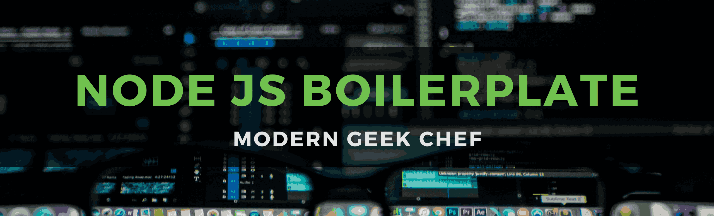

# Node.js Interactive RestAPI Boilerplate 



## Table of Contents
------------------ 

- [Getting Started](#getting-started)

## Getting Started

### 1. Get the latest clone
```git clone https://github.com/Mallaiya/node-restapi-boilerplate.git```

### 2. Change directory
```cd node-restapi-boilerplate```

### 3. Install NPM dependencies
```npm install```

### 4. Configurations
* Go to config file and config all needed configuration setups
* Use necessary keys in proper `.env` file

### 5. Generate Keys
Generate necessary private and public keys with passphrase for the project using following comment\
```openssl genrsa -out src/keys/jwt/private.pem -aes256 4096```\
```openssl rsa -pubout -in src/keys/jwt/private.pem -out src/keys/jwt/public.pem ```

### 6. Then simply start your development server
```npm run dev```

### License & copyrights
Copyright (c) 2020 Mallaiya M
Licensed under the [MIT License](LICENSE)

